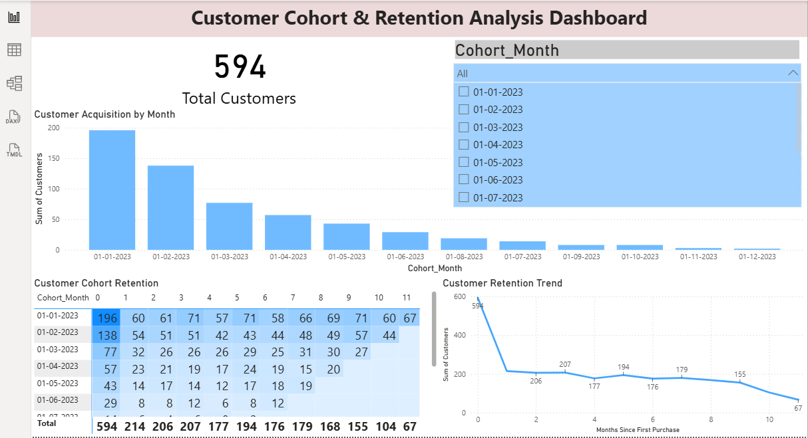

## Customer Cohort & Retention Analysis Dashboard

## Project Overview

This project analyzes customer transaction data to understand customer retention behavior over time using cohort analysis. Cohort analysis groups customers based on the month of their first purchase and tracks how many customers return in subsequent months.

The objective of this project is to help businesses understand customer retention patterns, repeat purchase behavior, and customer lifecycle trends.

The analysis was performed using MySQL for cohort calculation, Python for data analysis, Excel for validation, and Power BI for interactive visualization.

## Objectives

The main goals of this project are:

Identify customer cohorts based on their first purchase date

Analyze customer retention over time

Track repeat purchase behavior

Evaluate customer lifecycle patterns

Visualize retention metrics through an interactive dashboard

## Tools and Technologies Used

## MySQL

Cohort creation

Customer retention queries

Date calculations and aggregation

## Excel

Data validation

Dataset inspection

Basic pivot analysis

## Python

Exploratory data analysis (EDA)

Data visualization using Pandas, Matplotlib, and Seaborn

## Power BI

Interactive dashboard creation

Cohort retention matrix visualization

KPI reporting

## Dataset

The dataset contains customer transaction records including:

Customer_ID

Order_Date

Product_Category

Region

Sales_Value

The dataset contains 594 customers and their transaction history used to build cohort groups and retention metrics.

These fields are used to calculate customer cohorts and retention metrics.

## Project Workflow
1. Data Preparation

Imported customer order data
Checked duplicates and missing values
Validated dataset structure

2. Cohort Creation (SQL)

Customers were grouped into cohorts based on their first purchase month.
Example logic:
Identify first purchase date per customer
Convert it into cohort month
Track future purchases

3. Retention Calculation

Retention was calculated using month difference between cohort month and order month.
This allowed tracking how many customers returned in month 1, month 2, month 3, etc.

4. Python Analysis

Performed exploratory analysis to understand:
Purchase distribution
Customer activity patterns
Retention trends

5. Dashboard Development

The dataset was imported into Power BI to create an interactive dashboard.

## Dashboard Features
The dashboard includes:

## Key Metrics

Total Customers

Retained Customers

Retention Rate

## Visualizations

Cohort Retention Heatmap

Customer Acquisition by Month 

Retention Trend Over Time

Purchase Distribution

## Dashboard Preview

## Key Insights

Customer retention decreases over time after the first purchase.

Certain cohorts show stronger repeat purchase behavior.

Acquisition trends vary across months.

Retention analysis helps identify opportunities for improving customer loyalty.

## Author

Nagendra V Sagar

